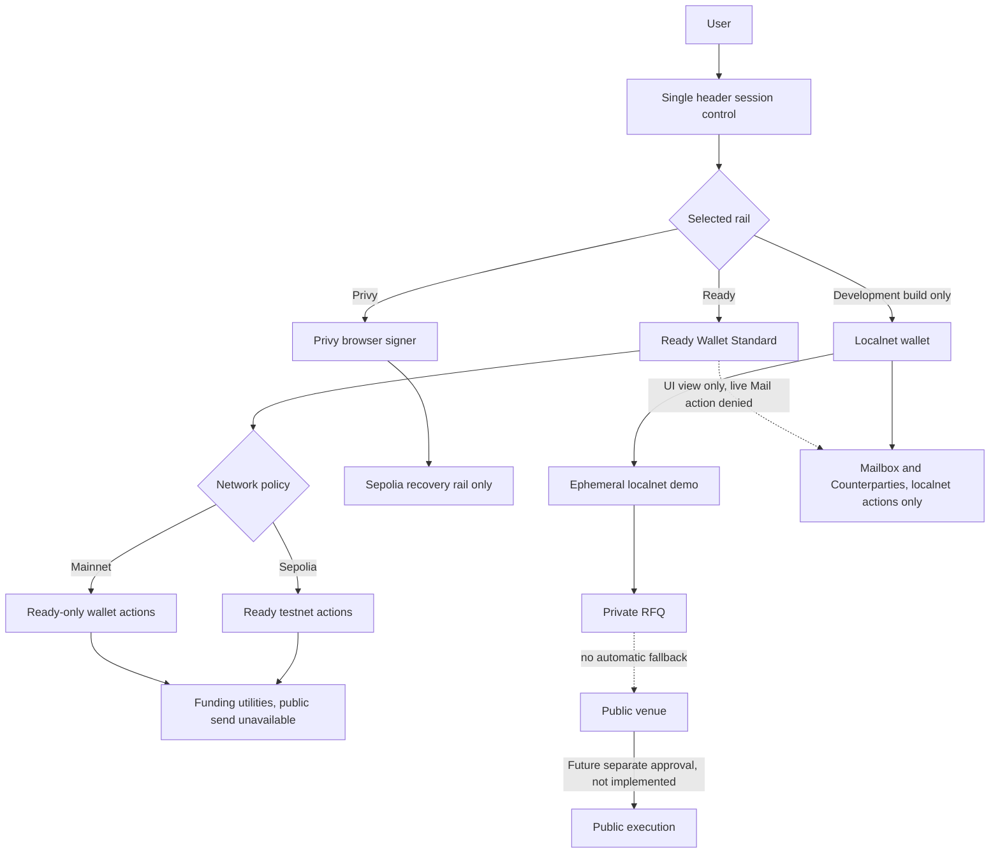
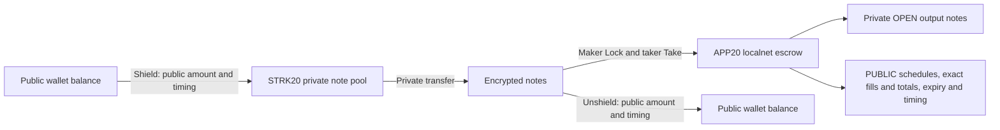
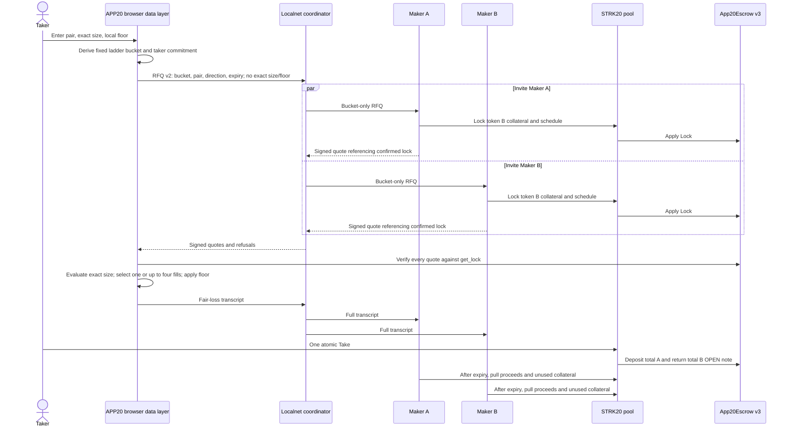
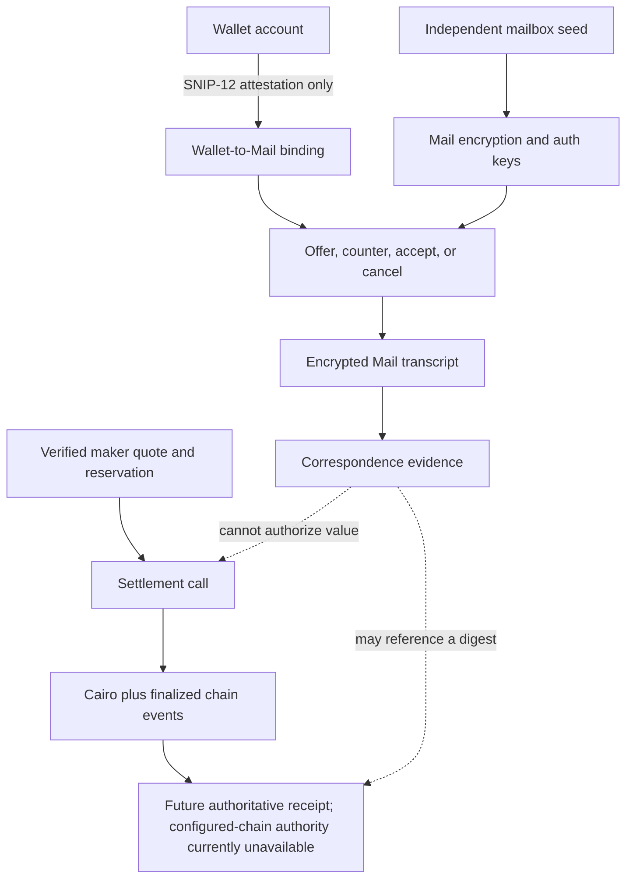
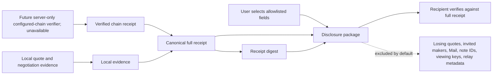
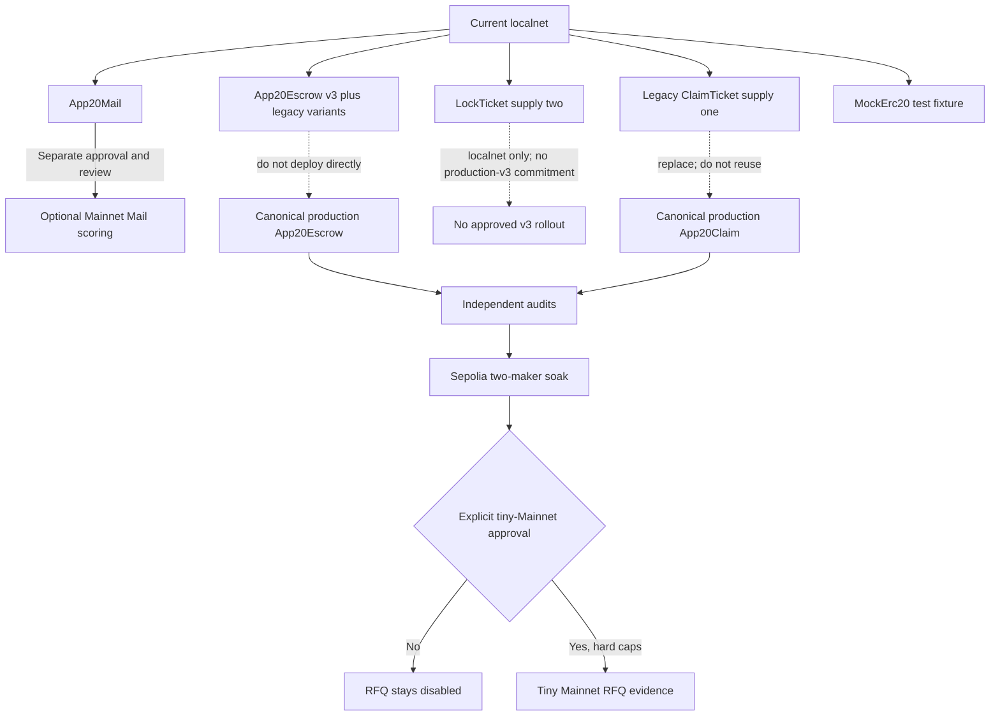
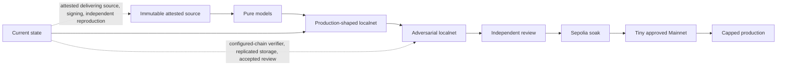

# APP20

Private RFQ product on Starknet. **The current repository is a build-gated
localnet demonstration; public-network RFQ transport and RFQ settlement
execution are disabled and unauthorized.**

Three surfaces form one workflow:

1. **RFQ** — collateralized, bucket-only private USDC↔STRK requests and atomic localnet Take
2. **Mailbox** — encrypted correspondence, structured evidence, invoice completion, and backup recovery
3. **Counterparties** — a device-encrypted directory with RFQ and Mail handoffs

**Chat** (`/chat`) complements them: it reads the same device-local records one
counterparty at a time. Multi-maker requests stay in the RFQ workspace.

Users connect once in the header. The Ready Wallet API path does not expose a
viewing key to APP20; the optional Privy browser-owned SDK derives/holds its
viewing key on the user's device. Mailbox keys also stay on-device. The STRK20
pool is reached through the existing Starknet privacy paths.
Dry cross-chain review and payment links remain secondary tools,
not part of the RFQ settlement path. APP20 uses the existing STRK20
privacy pool; deploying or letting users create a new dark pool, AMM, order
book, or liquidity pool is an explicit non-goal.

Repository: [github.com/gstohl/app20](https://github.com/gstohl/app20)

Start with [development setup](#develop), the [localnet demo](#localnet), or
[checks](#checks). Read [privacy](#privacy) and [contract rollout](#contract-rollout)
before interpreting the demo as production evidence.

`wrangler.jsonc` names `app20.gstohl.com` as the intended public host, but this
repository contains no successful deployment evidence. Do not infer that the
origin is live. This is not a Mainnet value-moving release.

## Product

| Surface         | Route                                                                               | Current scope                                                                                                            |
| --------------- | ----------------------------------------------------------------------------------- | ------------------------------------------------------------------------------------------------------------------------ |
| Private RFQ     | `/rfq`                                                                              | Two localnet fixture makers, collateralized quotes, browser selection, and atomic Take. No production maker network.     |
| Mailbox         | `/mail/inbox`                                                                       | Encrypted correspondence, payment handoffs, and self-backups. Evidence and recovery transport, not settlement authority. |
| Counterparties  | `/contacts`                                                                         | Device-encrypted labels and addresses with RFQ/Mail handoffs and optional encrypted backup.                              |
| Chat            | `/chat`                                                                             | One counterparty at a time: device-local letters, offers, invoices, and escrows with that contact, plus their open RFQs, pending payments, and escrows. Reads Mailbox's records; value actions stay in Mailbox. |
| Separate tools  | `/funding`, `/send`, `/cross-chain-review`, `/recovery/privy`, `/pay`               | Funding readiness, unavailable public send, dry cross-chain review, Privy recovery, and unsigned payment links.          |
| Read-only views | `/rfq/operations`, `/rfq/markets/:tokenA/:tokenB/proposal`, `/swap/:tokenA/:tokenB` | Operations status, proposal-only market planning, and non-executable pair handoffs.                                      |

`/pay` is a Mail helper, not a separate settlement product. It only creates an unsigned
payment-request link. Nothing is sent until the payer confirms in Mail.

### RFQ, Mailbox, and Counterparties

Within the localnet fixture, only Cairo plus pool-applied chain state can confirm
an RFQ lifecycle. Same-devnet confirmation is not production configured-chain
authority, which remains unavailable. Mail, signed quotes, transcript digests,
backup pointers, and browser/WAL records can carry evidence but cannot prove a
Take.

Counterparty labels and RFQ resume rows remain local unless the user explicitly
posts an encrypted self-backup through Mail. Small backups stay inline; larger
ones are AES-GCM encrypted and padded before a CIDv1 pointer is posted. RFQ
restore authenticates before ranking, rejects rollback/equivocation, imports
portable deletion tombstones, strips signing authority, and durably keeps every
restored v3 row verification-only through reload and re-export. The localnet
IPFS emulator is in-memory. Production blob storage fails closed unless reviewed
IPFS RPC/gateway origins and the matching relay CSP allowlist are set.

The same wallet opens all three surfaces. Shield, private transfer, and unshield
remain separate funding actions at `/funding`, which reports wallet-declared
STRK20 actions and canonical asset eligibility without probing private balances.
The localnet v3 invoice path consumes a scoped Mail handoff, turns private
STRK into a USDC OPEN note, records the confirmed Take, and lets Mail complete
the exact payment after ten blocks.

Dry cross-chain Intents live at `/cross-chain-review`, a fixture-backed review
of a pinned NEAR 1Click request/response shape. Nothing is sent to 1Click. This
rail has different signers, disclosure, and failure modes and is never merged
into the private RFQ submit path.

Wallet policy is enforced below the UI:

- **Mainnet** — reviewed Ready / Argent Wallet Standard feature IDs only
- **Sepolia** — Ready, plus an optional Privy browser signer
- **Localnet** — build-gated development wallet

In the product, mail is **Mailbox** / **Mail**. This pre-release namespace
reset renames the active contracts, storage keys, cryptographic domains,
environment variables, and localnet paths to APP20. Pre-reset browser data,
Mail ciphertext, signed payment links, and contract artifacts are not compatible
and are not silently migrated.

## How APP20 works

### Wallet and network rails



Mainnet rejects Privy and the development wallet. Selecting a rail never
silently borrows another rail's signer.

### STRK20 funding and visibility



The pool can hide private-transfer ownership and counterparties. It does not
hide v3 escrow facts: `LockCreated` publishes the schedule and collateral
maximum, `LockTaken` publishes each exact fill, and `DealTaken` publishes exact
aggregate A/B totals and fill count. The retained wire field `takerCommitment`
is the ephemeral taker Stark public key. Take calldata exposes its signature and
ordered fills; the private signing key stays local and is deleted after a
terminal Take.

The protected ComputeAndInvoke path derives an RFQ-scoped identity commitment
without exposing the pool-private identity key. Take v4 signs the native chain
ID, escrow, commitment, RFQ/deal, ordered tokens, and ordered fills digest.
A different private identity cannot reuse a captured signature. Commitments
differ across RFQs, but signatures, fills, and events remain linkable within
one RFQ. This is a pinned local client shim, not production-wallet compatibility
or public-network readiness.

Fund, Fill, Lock, and Take input accounting is measured inside the same outer
account transaction. A public `prepare_funding(token)` call runs before the
pool transfer, snapshots the actual transaction hash and escrow balance, and
is consumed exactly once by an exact-delta check. Old donations cannot
subsidize an input and excess input fails. The local wallet and maker use the
shared funding-preflight helper and allow at most one funded operation per
helper/token pair in a batch.

Mail uses the same transaction-local preparation for its fixed seven-base-unit
recovery deposit. Without a current snapshot, Mail is message-only and cannot
recover pre-existing donations. Nonzero Mail action IDs use proof-bound,
identity-scoped replay protection; zero IDs intentionally remain repeatable.

### Invited-maker RFQ v3



At invitation time makers learn the pair, direction, fixed bucket, RFQ/helper
bindings, and expiry—not the exact size or floor. The current full transcript
has winning `amountA` entries, so makers can infer exact size after selection by
summing them. One Take succeeds across every fill or reverts as a whole. There
is no v3 funded wait, maker fill, taker claim, or timeout/refund. The local
coordinator sees account/chain/cohort metadata, quotes/refusals, the full
transcript, and expected exact Take fills/totals; bucket-only disclosure is a
maker-invitation property, not a promise that the coordinator never learns
size. Refusal never routes to a public venue.

This service/data path is mounted and browser-tested in the build-gated
localnet. It is not configured-chain authority or public deployment evidence.
Legacy v1 rows retain their separate recovery actions.

### Maker lock recovery

```mermaid
stateDiagram-v2
    [*] --> Locking: fsync before wallet call
    Locking --> Open: confirmed lock matches chain
    Locking --> ReconcilePending: RPC/outcome unavailable
    Open --> Taken: chain reports earned proceeds
    Open --> Expired: expiry reached
    Taken --> Expired: expiry reached
    Expired --> Settling: fsync side before wallet call
    Settling --> Settled: both ticket units finalized; Cairo Closed
    Settling --> Expired: known revert, refresh chain
    Settling --> SettlementUnknown: submitted result uncertain
    ReconcilePending --> Open: chain proves open
    ReconcilePending --> Taken: chain proves Take
    ReconcilePending --> Expired: chain proves expiry/no Take
    SettlementUnknown --> Settled: chain proves both pulls
    SettlementUnknown --> ReconcilePending: chain disproves attempt
    ReconcilePending --> Quarantined: contradictory/malformed evidence
    SettlementUnknown --> Quarantined: contradictory/malformed evidence
    Quarantined --> ManualReview
```



After expiry, each lock's two ticket units are finalized independently. A
zero-payout side still burns its unit without creating an OPEN note. Once both
sides are finalized, Cairo records `Closed`; expired or closed locks cannot
supply executable quotes.

Each maker stores lock and legacy reservation records in one PID-locked,
hash-chain WAL. Unknown collateral is never counted as spare inventory.
Production still needs replicated linearizable coordinator/custody state and
configured-chain reconciliation.

Maker nodes also publish short-lived signed indicative mids. The localnet status
service and browser verify the fixture keys, then aggregate median and
dispersion; CoinGecko remains a separate direct-browser opt-in. Public pool
`Deposit` and `OpenNoteDeposited` events provide a bounded, chain-derived
10-block maturity estimate, not a complete view of private notes.

### Mail and settlement authority



Wallet signatures attest correspondence-key control; they are never encryption
key material. Mail can preserve evidence but cannot invoke or prove settlement.

### Receipt and disclosure



A digest binds bytes but is not authorization. A disclosure is a selected
package, not a zero-knowledge or Merkle proof, and a copied disclosure cannot
be revoked.

### Contract rollout



Nothing is authorized for deployment now. The localnet escrow constructor takes
the pool, `ClaimTicket` class hash, and `LockTicket` class hash. It retains v1
operations 0–3 and adds `Lock`, `Take`, `SettleProceeds`, and
`ReleaseCollateral` as 4–7. Those stable enum discriminants do not imply wire
compatibility: Fund calldata now includes an explicit amount, the protected
nonzero Mail and Take paths changed, and Take uses its v4 signed message. Deploy
the matching helper/contracts and client builders together on a fresh localnet.
Existing deployed contracts and private notes are not upgraded or migrated by
these local changes; preserve old runtime/history as evidence. Legacy operations
are slated for explicit later removal. This localnet class and `LockTicket` are
not production candidates. This localnet rollout grants no public deployment
authority and does not modify the separately frozen App20Escrow/App20Claim
VNext target. See
[`docs/APP20_CONTRACTS.md`](docs/APP20_CONTRACTS.md).

### Release ladder



Passing a UI test cannot skip an earlier trust gate. Current RFQ release scope
allows only the build-gated localnet demonstration and dry review. The
repository has deterministic SBOM/licence/notice and repeat-build checks, but
the latest dated capture covers an older source/SBOM state and does not attest
the current tree. CI provenance, release signing, and reproduction by two
independent builders remain open.
Detailed diagrams:
[`docs/APP20_PROCESS_DIAGRAMS.md`](docs/APP20_PROCESS_DIAGRAMS.md).

## Privacy

APP20 can hide in-pool transfers and encrypt mail. It cannot promise
unlinkability.

| Not directly exposed by the stated mechanism              | Public, disclosed, or still correlatable                                                                                                                                                                                                                                                       |
| --------------------------------------------------------- | ---------------------------------------------------------------------------------------------------------------------------------------------------------------------------------------------------------------------------------------------------------------------------------------------- |
| In-pool private-transfer ownership and amount             | Shield/unshield legs, timing, and amount correlation                                                                                                                                                                                                                                           |
| Exact RFQ size and floor during invitation                | Makers receive pair, direction, fixed bucket, RFQ/helper bindings, and expiry; transcript winner allocations can reveal size after selection                                                                                                                                                   |
| Private note ownership in v3 settlement                   | `LockCreated` schedules/collateral and taker public key, exact `LockTaken` fills, `DealTaken` totals/digest, Take signature/ordered fills, OPEN-note amounts, helper use and timing; the public helper/user identity commitment is RFQ-scoped, while activity within that RFQ remains linkable |
| Mail and backup plaintext                                 | Chain ciphertext metadata; an IPFS service sees CID, padded ciphertext size, source metadata, and timing                                                                                                                                                                                       |
| Device-local contact labels and notes                     | Addresses when publicly used; code running in an unlocked browser profile can read them                                                                                                                                                                                                        |
| Direct sender/recipient address fields in `MessagePosted` | Directory registration/lookups, helper access metadata, timing, and small-set inference                                                                                                                                                                                                        |
| OHTTP plaintext at the relay                              | Ciphertext metadata at the relay and the plaintext witness at the final prover after decapsulation                                                                                                                                                                                             |

A replaced frontend can still request signatures and read browser-owned keys.
Ready signatures are not used as encryption keys and the Ready Wallet API path
never requests a STRK20 viewing key. The optional Privy browser-owned SDK has a
separate, documented local viewing-key trust boundary. Wallet connection alone
cannot decrypt Mail or backups: recovery also requires the mailbox phrase. A
configured IPFS pinning/gateway service receives encrypted padded bytes, not the
phrase or snapshot plaintext; the local emulator keeps blocks only in memory.
Old chain ciphertext and public escrow events cannot be deleted. Cross-chain
amounts, assets, destinations, and timing remain correlatable.

## Develop

Requires Node.js 24+ and npm; CI pins Node.js 24.12.0. From the repository root:

```bash
npm ci
npm run build:packages
npm run dev
```

Open the URL printed by Vite (normally `http://localhost:5173`). This starts
the frontend only, not a privacy pool or localnet execution.

Optional Privy/IPFS configuration is documented in [`.env.example`](.env.example).
If needed, copy it to `.env.local` without overwriting an existing configuration,
then replace the placeholder values. The localnet launcher generates its own
`.env.localnet.local`; do not copy localnet values into a production build.

Every `VITE_*` value is public. Do not put RPC credentials, Privy App Secret,
prover or discovery origins, OHTTP session secrets, or partner keys in browser
env files. Those belong in Worker secrets after deploy.

This repository does not contain testnet or mainnet prover, discovery, or RPC
origins. Browser code only sees public metadata and non-routable `.invalid`
OHTTP names.

### Localnet

After installing the root dependencies above, run:

```bash
npm run pool:setup
npm run dev:localnet
```

Setup requires Git, curl, and tar. It installs the pinned pool source,
SDK/client dependencies, Scarb toolchains, and devnet under ignored `vendor/`
and `pool-harness/node_modules/` directories. It does not install root
dependencies or Starknet Foundry's `snforge`.

Keep the launcher running and open its printed URL. To stop it later, run
`npm run localnet:stop` in another terminal.

The launcher deploys the real Cairo pool, six-decimal local USDC, `App20Escrow`
with both ticket class hashes, two maker processes, and a loopback-only in-memory
IPFS emulator. RFQ v3 services support both USDC↔STRK directions: fixed ladder
buckets, confirmed collateral schedules, signed quotes/mids, fair-loss
transcripts, one-to-four-fill atomic Take, and automatic maker proceeds and
collateral pulls after expiry. Prices, accounts, and keys are localnet fixtures.
The pool uses simulated proofs; these tests do not establish production proof
verification.

The mounted desk exercises the localnet v3 request, maturity, single/split
selection, transcript, atomic Take, chain verification, invoice handoff, and
opt-in RFQ auto-backup paths; separate recovery UI preserves legacy v1 actions.
This is not a Mainnet market or send.

## Packages

| Package                   | Role                                                                                          |
| ------------------------- | --------------------------------------------------------------------------------------------- |
| `@app20/domain`           | Accounts, canonical intents, lifecycle                                                        |
| `@app20/near-intents`     | Dry-only NEAR 1Click connector                                                                |
| `@app20/policy-client`    | Attestation and policy-receipt verification                                                   |
| `@app20/privacy-adapters` | Fail-closed Starknet wallet and network policy                                                |
| `@app20/private-intents`  | Legacy RFQ plus v3 bucket, schedule, quote, selection, transcript, and maker-mid models       |
| `@app20/maker-node`       | Server-only WAL-backed reservations/locks, signing, collateral settlement, and crash recovery |
| `@app20/privy`            | Browser-owned STRK20 and Privy integration                                                    |
| `@app20/relay`            | Cloudflare assets, bootstrap, OHTTP, RPC, quotas                                              |

Architecture: [`docs/APP20_ARCHITECTURE.md`](docs/APP20_ARCHITECTURE.md).
Private RFQ and contact-recovery model:
[`docs/APP20_PRIVATE_DESK.md`](docs/APP20_PRIVATE_DESK.md).
Engineering gap register (what still has to be built):
[`docs/GAPS.md`](docs/GAPS.md).
Current localnet RFQ flow plus explicitly archived/rejected sketches and the
separately gated SOL/Wormhole→StarkGate proposal:
[`docs/APP20_SWAP_FLOWS.md`](docs/APP20_SWAP_FLOWS.md).
Contract inventory and rollout gates:
[`docs/APP20_CONTRACTS.md`](docs/APP20_CONTRACTS.md).
Negotiation/channel protocols and operations boundaries:
[`docs/APP20_NEGOTIATION_CHANNELS.md`](docs/APP20_NEGOTIATION_CHANNELS.md) and
[`docs/APP20_OPERATIONS_AND_INTEGRATIONS.md`](docs/APP20_OPERATIONS_AND_INTEGRATIONS.md).
Adversarial review and current release verdict:
[`docs/APP20_ADVERSARIAL_VALIDATION.md`](docs/APP20_ADVERSARIAL_VALIDATION.md) and
[`docs/APP20_RELEASE_GATES.md`](docs/APP20_RELEASE_GATES.md).

## Checks

After `npm ci`, run the application and package checks:

```bash
npm run build:packages
npm run test:all
npm run build
```

`build` includes application and workspace typechecks. `test:all` does **not**
run Cairo tests, real-pool integration, or browser journeys.

For contracts, install **Scarb 2.18.0** and **Starknet Foundry 0.63.0**
(`snforge`) on your PATH, matching [CI](.github/workflows/ci.yml):

```bash
(cd cairo && scarb fmt --check && scarb build && snforge test)
npm run pool:setup
npm run test:e2e:pool
```

Pool setup keeps the upstream pool's Scarb 2.17.0 separate from APP20's Scarb
2.18.0. Do not use the pool compiler for APP20 unit tests. CI runs Cairo and
real-pool checks as separate jobs.

Browser checks require Playwright Chromium:

```bash
npx playwright install chromium
npm run check:csp
```

Run `check:csp` after a successful production build. `npm run test:ui` stops
any existing managed localnet and starts a fresh one. To keep a caller-managed
server running, use
`APP20_TEST_BASE_URL=http://127.0.0.1:5173 npm run test:ui`.
The journeys still submit localnet transactions; do not use runtime state you
need to preserve.

| Command                           | Scope                                                                                                       |
| --------------------------------- | ----------------------------------------------------------------------------------------------------------- |
| `npm test`                        | Application unit tests                                                                                      |
| `npm run test:packages`           | Workspace packages                                                                                          |
| `npm run test:ui`                 | Playwright localnet journeys, including scope invalidation, accessibility, and 200% reflow                  |
| `npm run test:supply-chain`       | Lockfile integrity/source/licence review, SBOM drift, generated font notices, and build-determinism helpers |
| `npm run test:e2e:pool`           | Simulated-proof devnet tests: pool transfers, Mail replay/funding isolation, and Lock/Take/settlement       |
| `npm run check:csp`               | Loads built routes under the CSP the Worker actually ships                                                  |
| `npm run check:build-determinism` | Two isolated production builds, byte-compared                                                               |
| `npm run sbom:generate`           | Regenerates the deterministic CycloneDX SBOM and deployable font notices                                    |
| `snforge test`                    | Cairo mail and escrow unit tests with mocked pool callers, from `cairo/`                                    |

`npm run build` also enforces recorded per-chunk byte budgets, fails if direct
`eval` enters the initial graph or appears outside the reviewed lazy
wallet-discovery chunk, rejects Node builtin imports in emitted browser chunks,
scans for browser leaks, and re-checks the release-deny policy. The reviewed
lazy chunk still contains dormant direct `eval`; the shipping CSP omits
`'unsafe-eval'`, so this is a recorded compatibility residual, not a claim that
all browser chunks are eval-free.

### Supply chain and release evidence

`docs/evidence/app20-sbom.cdx.json` is a CycloneDX 1.5 SBOM (755 components)
derived only from `package-lock.json` with no network access, wall-clock
timestamp, or random serial number, so fresh generation is byte-stable. Every
component has a recorded licence choice. The dependency gate rejects missing
integrity, non-canonical sources, licence-baseline drift, unbounded unknown
licences, SBOM drift, deployable font-notice drift, and changes to the reviewed
vendored tarball's pinned SHA-256. Six exact releases still use bounded
`NOASSERTION` exceptions, and the generated deployable notice covers the three
redistributed OFL fonts only; publisher/legal disposition and a complete notice-
obligation review remain release blockers. Dated gate captures are
recorded in [`docs/APP20_RELEASE_GATES.md`](docs/APP20_RELEASE_GATES.md); they
are self-reported single-machine evidence, not current CI provenance, a
signature, independent reproduction, or legal acceptance.

Security policy and private vulnerability reporting:
[`SECURITY.md`](SECURITY.md). No independent security audit has been accepted.

## Deployment

APP20 is configured to deploy as a Cloudflare Worker with assets, not a static
Pages site. `wrangler.jsonc` names `app20.gstohl.com`; configuration is not
deployment evidence. Do not deploy until Worker secrets are set with
`wrangler secret put`, and do not treat secrets alone as satisfying any release
gate.

The Worker runs first and replaces asset security headers, so
`workers/relay/src/headers.ts` is the single source of the shipped
Content-Security-Policy; a static `_headers` file would never reach a browser.
That policy omits `'unsafe-eval'`. The configured policy permits reviewed
Privy authentication/API origins and CoinGecko for public market data.
Expanding the RFQ's “Public market context” panel does not contact CoinGecko;
data loads only after the separate explicit opt-in. Optional `IPFS_ORIGINS` may
add reviewed HTTPS origins to `connect-src` for encrypted backup upload/fetch;
invalid origins fail closed and an unset
value leaves the prior CSP unchanged. IPFS RPC/gateway requests go directly
from the browser, so those operators can observe source metadata, timing, CID,
and padded ciphertext size. `npm run check:csp` loads the configured built-route
set through the real Worker handler and compares observed violations with
`scripts/production-csp-known-violations.json`, currently empty.

Public browser variables:

```text
VITE_PRIVY_APP_ID
VITE_PRIVY_CLIENT_ID
VITE_PROVER_OHTTP_KEY_CONFIG
VITE_DISCOVERY_OHTTP_KEY_CONFIG
VITE_IPFS_RPC_ORIGIN              # optional; configure with gateways
VITE_IPFS_GATEWAY_ORIGINS         # optional comma-separated HTTPS origins

# APP20 Mail/escrow addresses are localnet-generated only. Live helper build
# variables are not part of the runtime configuration surface.
```

Optional ordinary Worker variable (not a secret):

```text
IPFS_ORIGINS                      # match the reviewed browser IPFS origins
```

Worker secrets:

```text
PRIVY_APP_SECRET
OHTTP_SESSION_SECRET
PROVER_UPSTREAM_URL
PROVER_UPSTREAM_AUTHORIZATION
DISCOVERY_UPSTREAM_URL
DISCOVERY_UPSTREAM_AUTHORIZATION
STARKNET_SEPOLIA_RPC_URL
STARKNET_SEPOLIA_AUTHORIZATION
STARKNET_MAINNET_RPC_URL
STARKNET_MAINNET_AUTHORIZATION
```

## Not in this release

- Production maker-specific HPKE transport or replicated reservation/coordinator storage
- A deployed/audited canonical production escrow, atomic two-taker crossing, or recurring escrow
- Configured-chain authoritative receipt verification
- Live NEAR Intents quotes, deposits, or settlement
- An attested TEE that can authorize value
- Completed `strk20.json` sprint artifacts
- A production Cloudflare deployment

## License

APP20-authored source is MIT-licensed; see [`LICENSE`](LICENSE). Third-party
materials retain their own terms. See [`NOTICE`](NOTICE), the generated
[`public/THIRD_PARTY_NOTICES.txt`](public/THIRD_PARTY_NOTICES.txt), and the SBOM.
Six dependency releases still lack accepted release-specific licence evidence,
so the licence-disposition release gate in
[`docs/APP20_RELEASE_GATES.md`](docs/APP20_RELEASE_GATES.md) remains open.
