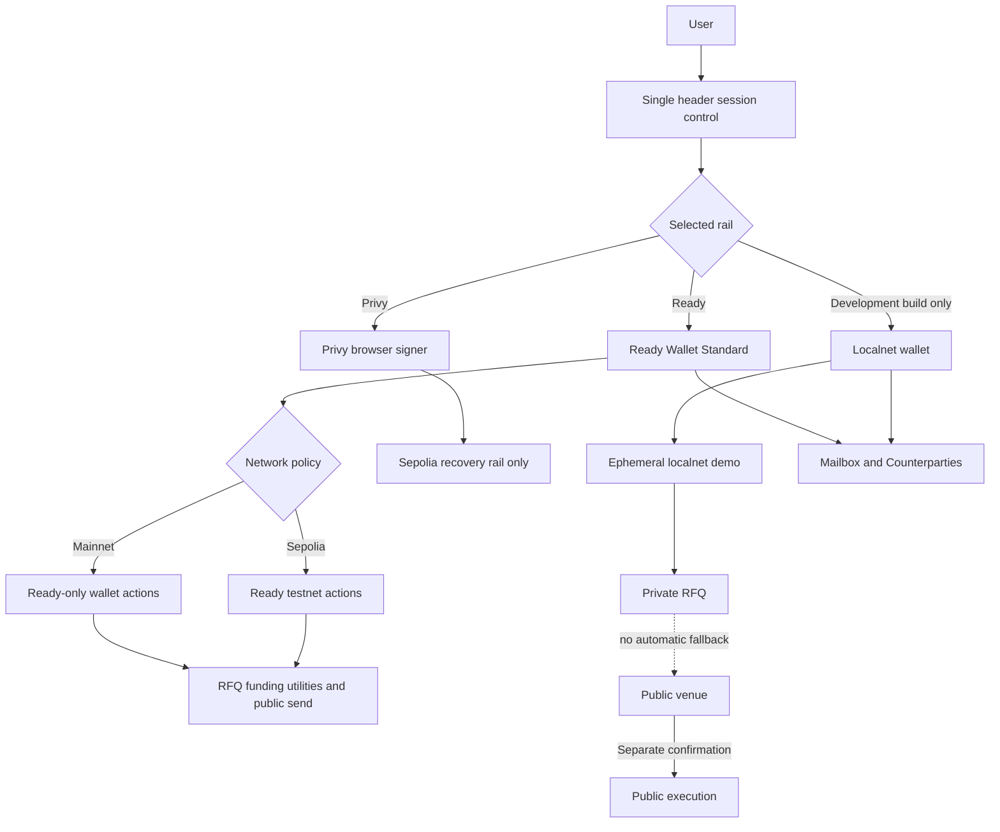
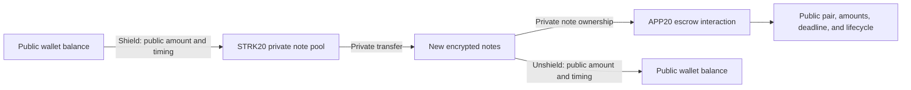
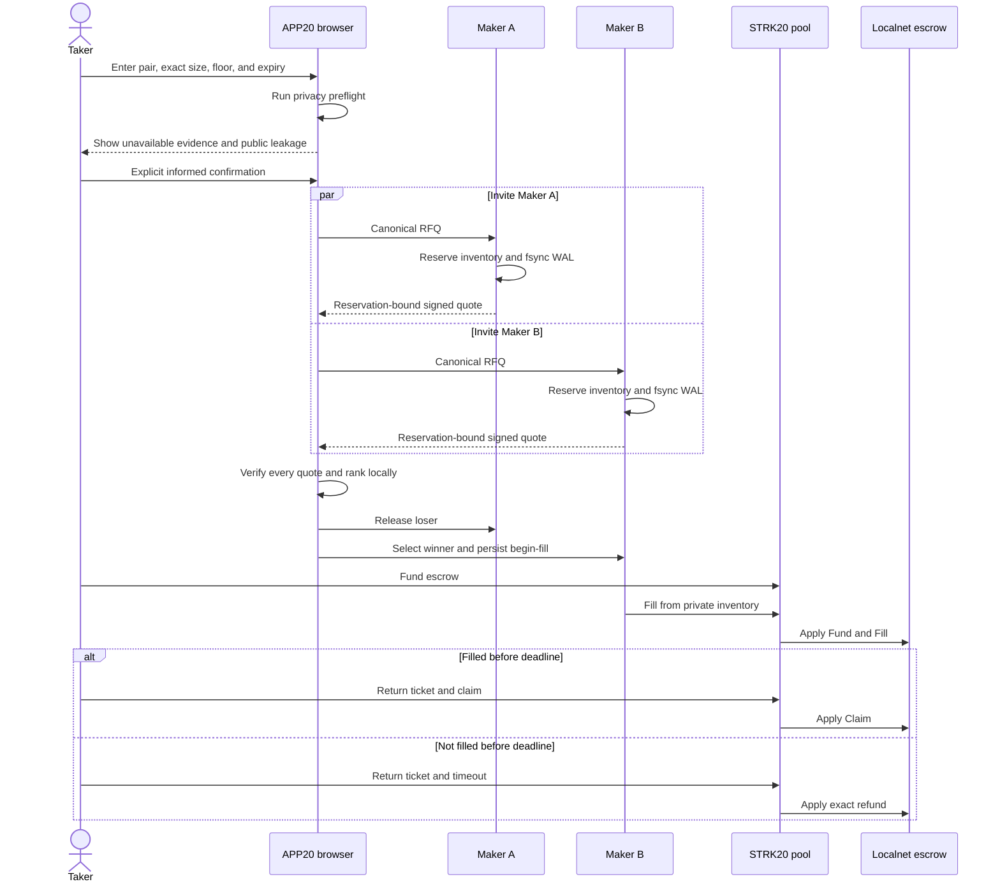
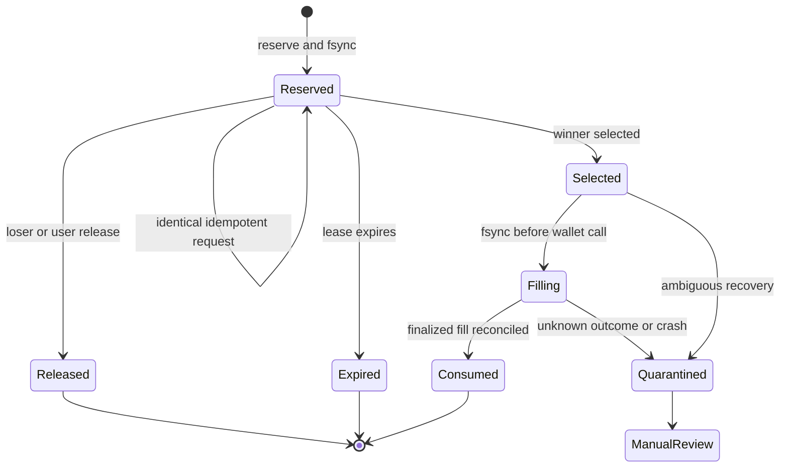
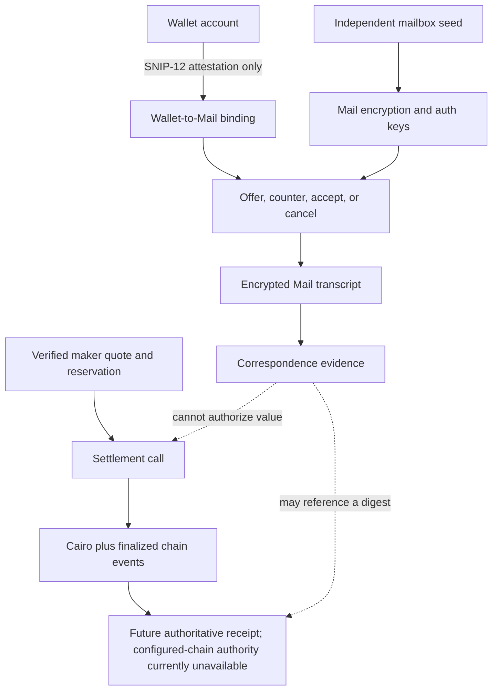
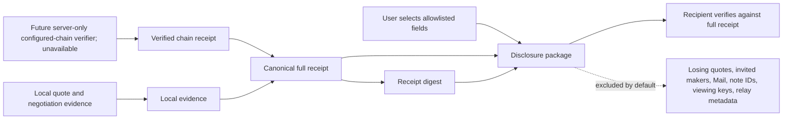
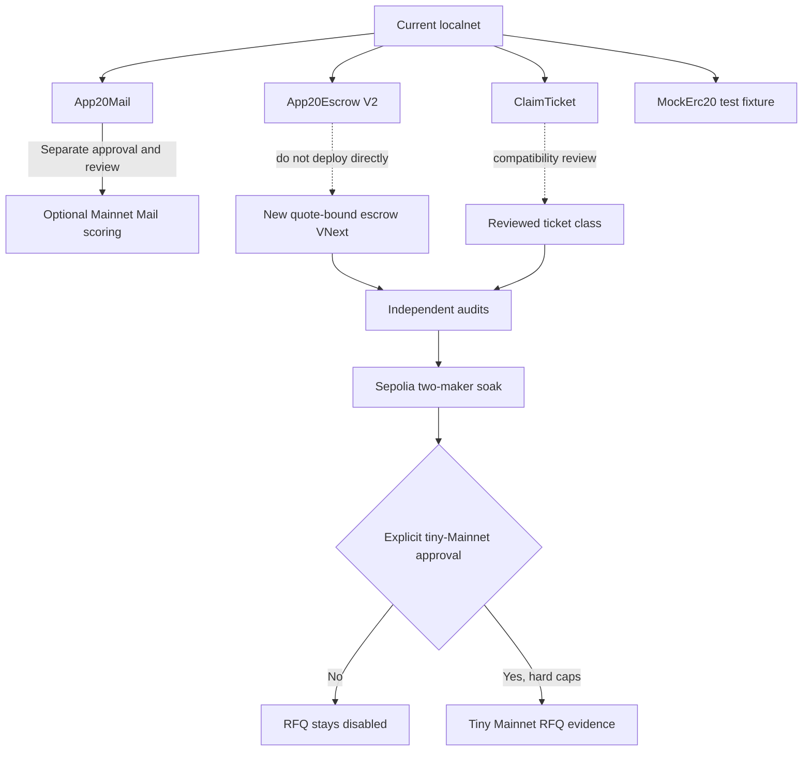
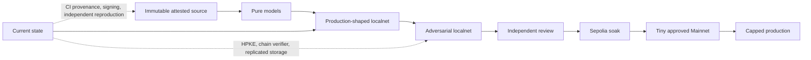

# APP20

Professional private RFQ venue on Starknet.

Three surfaces form one workflow:

1. **RFQ** — inventory-backed private USDC↔STRK requests and shielded funding
2. **Mailbox** — encrypted deal correspondence, structured evidence, and contact recovery
3. **Counterparties** — a device-encrypted directory with RFQ and Mail handoffs

Users connect once in the header. The Ready Wallet API path does not expose a
viewing key to APP20; the optional Privy browser-owned SDK derives/holds its
viewing key on the user's device. Mailbox keys also stay on-device. The STRK20
pool is reached through the reviewed Starknet privacy paths.
Dry cross-chain review and payment links remain secondary tools,
not separate claims in the judged trading flow. APP20 uses the existing STRK20
privacy pool; deploying or letting users create a new dark pool, AMM, order
book, or liquidity pool is an explicit non-goal.

Repository: [github.com/gstohl/app20](https://github.com/gstohl/app20)

The first intended public host is `app20.gstohl.com`. That origin is not live
yet. This is not a Mainnet value-moving release.

## Product

| Rank | Feature | Route | Status |
| --- | --- | --- | --- |
| 1 | Private RFQ | `/rfq` | Localnet solicits two sealed USDC↔STRK makers with distinct processes, settlement accounts, quote keys, private-note inventories, and fsynced reservation WALs. APP20 verifies both signatures, selects deterministically, and proves crash recovery, lock, fill, claim, expiry refund, and insufficient-inventory refusal. Every saved record carries an authority label separating a local observation from a chain-verified localnet outcome, and disagreement, reorg, or quarantine blocks its actions. No order book is published. Funding remains a distinct STRK20 rail. No production maker network is deployed |
| 2 | Mailbox | `/mail/inbox` | On-chain ciphertext for letters, legacy OTC documents, receipts, and authenticated self-addressed contact snapshots. Mail is correspondence/evidence, never settlement authority |
| 3 | Counterparties | `/contacts` | Device-encrypted labels and addresses with RFQ/Mail deep links. Optional recovery needs the same wallet plus the mailbox recovery phrase |
| 4 | Separate operations | `/funding`, `/send`, `/cross-chain-review`, `/recovery/privy`, `/pay` | Funding readiness, public send, dry cross-chain review, Privy recovery, and unsigned payment links. Each is its own route behind a shared `Not RFQ settlement authority` boundary. No live 1Click submission or TEE execution |
| — | Read-only surfaces | `/rfq/operations`, `/rfq/markets/:tokenA/:tokenB/proposal`, `/swap/:tokenA/:tokenB` | Browser-safe operations status, proposal-only market planning, and a non-executable pair handoff. None can deploy, fund, or settle |

`/pay` is a Mail helper, not a fifth product. It only creates an unsigned
payment-request link. Nothing is sent until the payer confirms in Mail.

### RFQ, Mailbox, and Counterparties

The RFQ is authoritative only when Cairo and the pool confirm its lifecycle.
Mailbox letters can carry coordination and evidence but cannot prove a fill.
Counterparty labels remain local unless the user explicitly posts an encrypted
self-backup through Mail.

The same wallet opens all three surfaces. A Counterparty can start a prefilled
RFQ or encrypted letter; a settled local RFQ produces a lifecycle receipt and
links back to Mailbox. Shield, private transfer, and unshield remain separate
funding actions at `/funding`, which reports the wallet-declared STRK20 actions
and canonical asset eligibility without probing private balances.

Dry cross-chain Intents live at `/cross-chain-review`, a public review rail
against NEAR 1Click. They have different signers, disclosure, and failure modes
and are never merged into the private RFQ submit path.

Wallet policy is enforced below the UI:

- **Mainnet** — reviewed Ready / Argent Wallet Standard feature IDs only
- **Sepolia** — Ready, plus an optional Privy browser signer
- **Localnet** — build-gated development wallet

In the product, mail is **Mailbox** / **Mail**. This pre-release namespace
reset renames the active contracts, storage keys, cryptographic domains,
environment variables, and localnet paths to APP20. Pre-reset browser data,
Mail ciphertext, signed payment links, and contract artifacts are not compatible
and are not silently migrated.

## How APP20 works

### Wallet and network rails



Mainnet rejects Privy and the development wallet. Selecting a rail never
silently borrows another rail's signer.

### STRK20 funding and visibility



The pool can hide private-transfer ownership and counterparties. Shield,
unshield, and first-version settlement remain public and correlatable.

### Invited-maker RFQ



Only invited makers receive exact pre-trade terms. There is no public RFQ book,
and refusal never triggers automatic public routing.

### Maker reservation and recovery



Localnet uses one PID-locked hash-chain WAL per maker. Production still needs
replicated linearizable storage and chain reconciliation.

### Mail and settlement authority



Wallet signatures attest correspondence-key control; they are never encryption
key material. Mail can preserve evidence but cannot invoke or prove settlement.

### Receipt and disclosure



A digest binds bytes but is not authorization. A disclosure is a selected
package, not a zero-knowledge or Merkle proof, and a copied disclosure cannot
be revoked.

### Contract rollout



Nothing is authorized for deployment now. `App20Escrow` is a localnet
development contract, not the production class. See
[`docs/APP20_CONTRACTS.md`](docs/APP20_CONTRACTS.md).

### Release ladder



Passing a UI test cannot skip an earlier trust gate. Current evidence allows
only the build-gated localnet demonstration and dry review. The source is now
committed with a recorded rollback target, a deterministic SBOM, lockfile
integrity and source review, and byte-identical repeat builds; CI provenance,
release signing, and reproduction by two independent builders remain open.
Detailed diagrams:
[`docs/APP20_PROCESS_DIAGRAMS.md`](docs/APP20_PROCESS_DIAGRAMS.md).

## Privacy

APP20 can hide in-pool transfers and encrypt mail. It cannot promise
unlinkability.

| Hidden | Public |
| --- | --- |
| In-pool sender, recipient, and amount | Shield and unshield |
| Mail plaintext and self-backed contact labels | Ciphertext, size, timing, helper use, recipient count, backup frequency |
| Device-local contact labels and notes | Addresses when publicly used; code running in an unlocked browser profile can read them |
| Sender and recipient addresses in `MessagePosted` | Directory lookups at the configured RPC |
| Private note ownership in the RFQ | Prototype escrow pair, amounts, deadline, OPEN-note amount, and helper activity |
| OHTTP ciphertext on the relay | The final prover after decapsulation |

A replaced frontend can still request signatures and read browser-owned keys.
Ready signatures are not used as encryption keys and the Ready Wallet API path
never requests a STRK20 viewing key. The optional Privy browser-owned SDK has a
separate, documented local viewing-key trust boundary. Wallet connection identifies the mailbox but cannot decrypt
Mail or contact snapshots by itself: recovery also requires the mailbox backup
phrase. Old on-chain ciphertext cannot be deleted. Cross-chain amounts, assets,
destinations, and timing remain correlatable.

## Develop

Requires Node.js 24+. From the repository root:

```bash
npm install --ignore-scripts
cp .env.example .env.local
npm run dev
```

Open `http://127.0.0.1:5173`.

Every `VITE_*` value is public. Do not put RPC credentials, Privy App Secret,
prover or discovery origins, OHTTP session secrets, or partner keys in browser
env files. Those belong in Worker secrets after deploy.

This repository does not contain testnet or mainnet prover, discovery, or RPC
origins. Browser code only sees public metadata and non-routable `.invalid`
OHTTP names.

### Localnet

```bash
npm run pool:setup
npm run dev:localnet
npm run localnet:stop
```

This deploys the real Cairo pool, a six-decimal local USDC fixture, and the
production mail action sequence, including the fixed 7-base-unit helper funding
withdrawal. It also proves both directions of the private USDC↔STRK RFQ market:
lock, inventory-first solver fill, claim, expiry refund, and insufficient-
inventory refusal. The selected maker is SIGKILLed after quote selection,
automatically restarts from its `0600` hash-chain WAL, and then completes the
fill. The browser journey also proves Counterparty → RFQ handoff and contact
snapshot → encrypted self-mail → explicit merge restore. Prices and private
keys are deterministic localnet fixtures and proof bytes are simulated. This is
not a Mainnet market or send.

## Packages

| Package | Role |
| --- | --- |
| `@app20/domain` | Accounts, canonical intents, lifecycle |
| `@app20/near-intents` | Dry-only NEAR 1Click connector |
| `@app20/policy-client` | Attestation and policy-receipt verification |
| `@app20/privacy-adapters` | Fail-closed Starknet wallet and network policy |
| `@app20/private-intents` | Canonical RFQ, signed directory, HPKE envelope, quote, reservation, and settlement models |
| `@app20/maker-node` | Server-only WAL-backed reservation, signing, custody-adapter, and crash-recovery core |
| `@app20/privy` | Browser-owned STRK20 and Privy integration |
| `@app20/relay` | Cloudflare assets, bootstrap, OHTTP, RPC, quotas |

Architecture: [`docs/APP20_ARCHITECTURE.md`](docs/APP20_ARCHITECTURE.md).
Private RFQ and contact-recovery model:
[`docs/APP20_PRIVATE_DESK.md`](docs/APP20_PRIVATE_DESK.md).
Canonical definitive goals, non-goals, and gap register:
[`docs/APP20_RFQ_GAPS.md`](docs/APP20_RFQ_GAPS.md).
Value flows and the gated future SOL/Wormhole→StarkGate market:
[`docs/APP20_SWAP_FLOWS.md`](docs/APP20_SWAP_FLOWS.md).
Contract inventory and rollout gates:
[`docs/APP20_CONTRACTS.md`](docs/APP20_CONTRACTS.md).
Negotiation/channel protocols and operations boundaries:
[`docs/APP20_NEGOTIATION_CHANNELS.md`](docs/APP20_NEGOTIATION_CHANNELS.md) and
[`docs/APP20_OPERATIONS_AND_INTEGRATIONS.md`](docs/APP20_OPERATIONS_AND_INTEGRATIONS.md).
Adversarial review and current release verdict:
[`docs/APP20_ADVERSARIAL_VALIDATION.md`](docs/APP20_ADVERSARIAL_VALIDATION.md) and
[`docs/APP20_RELEASE_GATES.md`](docs/APP20_RELEASE_GATES.md).

## Checks

```bash
npm run typecheck
npm run typecheck:packages
npm run test:all
npm run build
```

| Command | Scope |
| --- | --- |
| `npm test` | Application unit tests (108 files, 944 tests) |
| `npm run test:packages` | Workspace packages |
| `npm run test:ui` | 16 Playwright localnet journeys, including accessibility and 200% reflow |
| `npm run test:supply-chain` | Lockfile integrity/source review and SBOM drift |
| `npm run test:e2e:pool` | Real-pool mail harness |
| `npm run check:csp` | Loads built routes under the CSP the Worker actually ships |
| `npm run check:build-determinism` | Two isolated production builds, byte-compared |
| `npm run sbom:generate` | Regenerates the deterministic CycloneDX SBOM |
| `snforge test` | Mail helper contracts, from `cairo/` |

`npm run build` also enforces recorded per-chunk byte budgets, fails if a direct
`eval` or Node builtin import reaches a browser chunk, scans for browser leaks,
and re-checks the release-deny policy.

### Supply chain and release evidence

`docs/evidence/app20-sbom.cdx.json` is a CycloneDX 1.5 SBOM (755 components)
derived only from `package-lock.json` with no network access, no wall-clock
timestamp, and no random serial number, so it is byte-stable across runs. The
dependency gate fails when a lock entry lacks an integrity hash, resolves to
anything other than its own name-and-version-specific canonical registry
tarball or the one reviewed vendored locator whose bytes are pinned by SHA-256,
or when the committed SBOM drifts. Gate results are recorded in
[`docs/APP20_RELEASE_GATES.md`](docs/APP20_RELEASE_GATES.md). These are
self-reported single-machine checks, not CI provenance, a signature, or an
independent reproduction.

Security policy and private vulnerability reporting:
[`SECURITY.md`](SECURITY.md). No independent security audit has been accepted.

## Deployment

APP20 deploys as a Cloudflare Worker with assets, not a static Pages site.
`wrangler.jsonc` names `app20.gstohl.com`. Do not deploy until Worker secrets
are set with `wrangler secret put`.

The Worker runs first and replaces asset security headers, so
`workers/relay/src/headers.ts` is the single source of the shipped
Content-Security-Policy; a static `_headers` file would never reach a browser.
That policy omits `'unsafe-eval'`. One known consequence is recorded in
`scripts/production-csp-known-violations.json`: `connect-src` does not allow
`api.coingecko.com`, so the opt-in public price chart reports that candlesticks
are unavailable on a deployed origin. `npm run check:csp` fails if that set of
violations changes in either direction.

Public browser variables:

```text
VITE_PRIVY_APP_ID
VITE_PRIVY_CLIENT_ID
VITE_PROVER_OHTTP_KEY_CONFIG
VITE_DISCOVERY_OHTTP_KEY_CONFIG

# APP20 Mail/escrow addresses are localnet-generated only. Live helper build
# variables are not part of the runtime configuration surface.
```

Worker secrets:

```text
PRIVY_APP_SECRET
OHTTP_SESSION_SECRET
PROVER_UPSTREAM_URL
PROVER_UPSTREAM_AUTHORIZATION
DISCOVERY_UPSTREAM_URL
DISCOVERY_UPSTREAM_AUTHORIZATION
STARKNET_SEPOLIA_RPC_URL
STARKNET_SEPOLIA_AUTHORIZATION
STARKNET_MAINNET_RPC_URL
STARKNET_MAINNET_AUTHORIZATION
```

## Not in this release

- Production maker-specific HPKE transport or replicated reservation storage
- A deployed/audited quote-bound escrow, atomic crossing, or recurring escrow
- Configured-chain authoritative receipt verification
- Live NEAR Intents quotes, deposits, or settlement
- An attested TEE that can authorize value
- Completed `strk20.json` sprint artifacts
- A production Cloudflare deployment

## License

MIT
