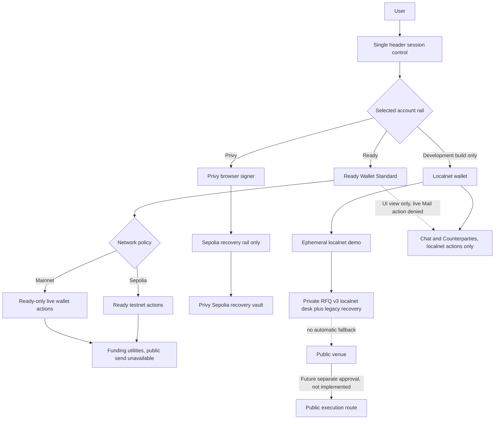
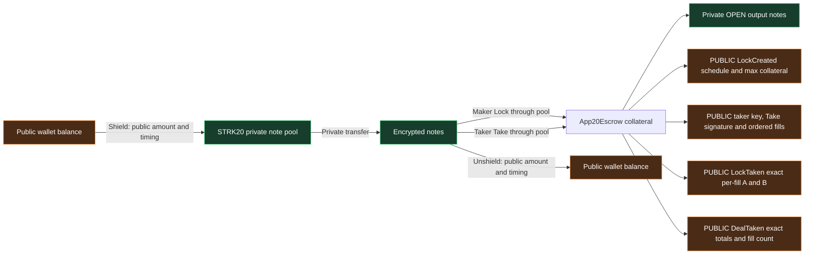
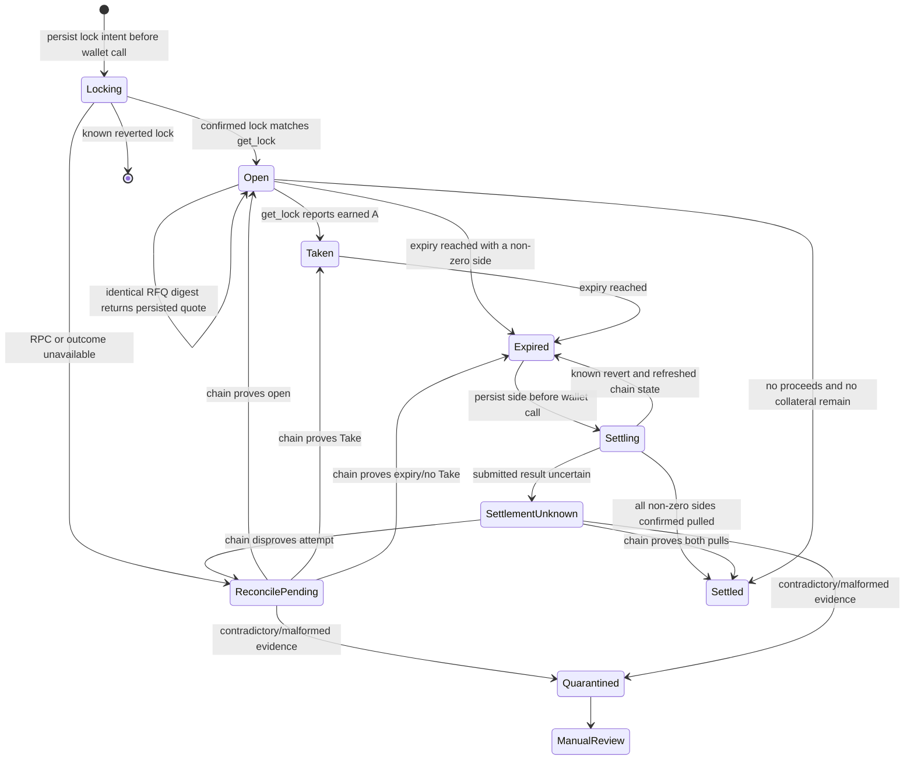
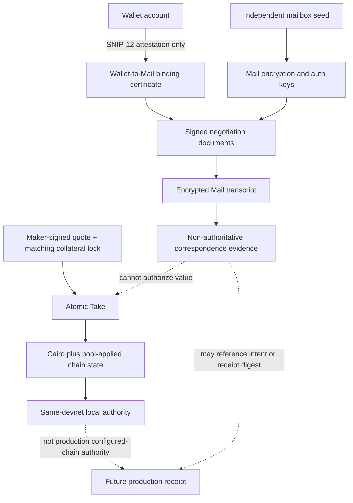
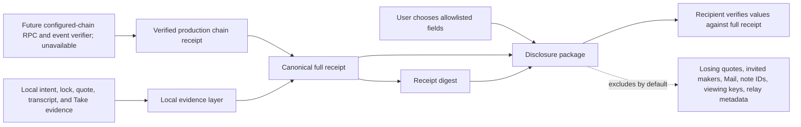
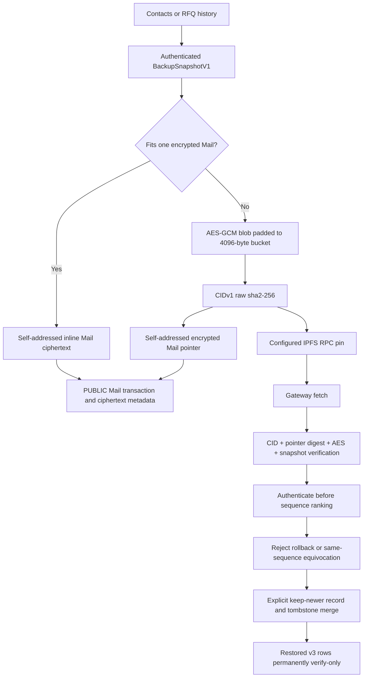
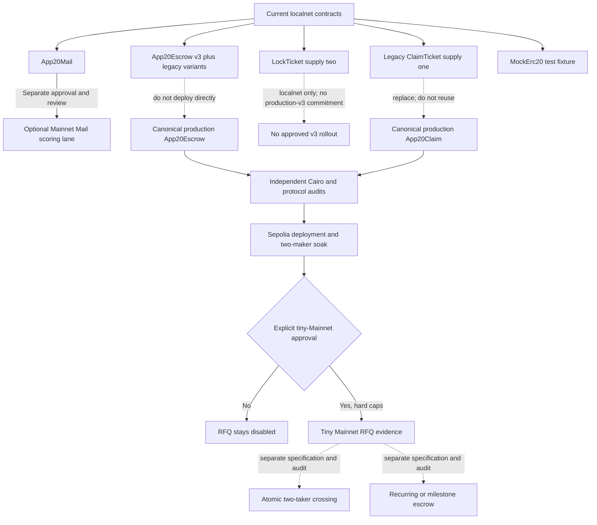
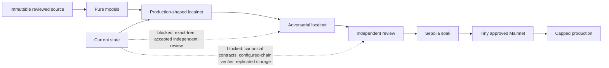

# APP20 process diagrams

These Mermaid diagrams describe current repository behavior and explicit future gates. Dashed or blocked paths are not live capabilities. RFQ v3 is mounted only in the build-gated localnet; legacy v1 lifecycle records retain separate recovery actions. Public-network RFQ remains immutable-off.

## 1. Wallet, network, and product rails



Mainnet rejects Privy and the development wallet. Localnet exists only when its build flag is enabled. Selecting one rail never silently borrows another rail's signer. Public-network RFQ transport and settlement remain immutable-off.

## 2. STRK20 funding and v3 public boundary



The pool can hide note ownership and private-transfer counterparties. It does not hide shield/unshield boundaries or v3 helper facts. A schedule, pair, RFQ id, expiry, collateral maximum, taker public key, Take signature and ordered fills, exact fills/digest, aggregate totals, helper use, OPEN-note amount, and timing are public and correlatable. The signature cannot bind output-note ownership through the current pool API, leaving a relayer/sequencer copy-sniping race.

## 3. Collateralized, bucket-only RFQ v3

```mermaid
sequenceDiagram
    actor T as Taker
    participant B as APP20 browser data layer
    participant C as Localnet coordinator
    participant A as Maker A node
    participant M as Maker B node
    participant P as STRK20 pool
    participant E as App20Escrow v3

    T->>B: Enter pair, exact size, local floor
    B->>B: Derive ladder bucket and ephemeral Stark key
    B->>C: RFQ v2: pair, direction, bucket, expiry; no exact size/floor

    par Invite Maker A
        C->>A: RFQ v2
        A->>P: Lock token B maximum + two-unit ticket note
        P->>E: Apply Lock with schedule
        A-->>C: Signed quote v3 referencing confirmed lock
    and Invite Maker B
        C->>M: RFQ v2
        M->>P: Lock token B maximum + two-unit ticket note
        P->>E: Apply Lock with schedule
        M-->>C: Signed quote v3 referencing confirmed lock
    end

    C-->>B: Quotes and refusal digests
    B->>E: Read every get_lock
    B->>B: Verify signatures and locks; evaluate exact size
    B->>B: Select one or up to four fills; apply local floor
    B->>C: Digest-bound fair-loss transcript
    C->>A: Full transcript
    C->>M: Full transcript
    T->>B: Explicit final acceptance
    B->>P: One signed Take with exact ordered fills/digest
    P->>E: Apply atomic Take
    E-->>P: One aggregate token B OPEN deposit
    P-->>T: Private output note

    Note over A,M: After expiry, each maker scans get_lock every 5 s
    A->>P: SettleProceeds and/or ReleaseCollateral
    M->>P: SettleProceeds and/or ReleaseCollateral
    P->>E: Burn one LockTicket per non-zero side
```

Any invalid fill reverts the whole Take. There is no v3 taker claim ticket, funded wait, maker fill step, or taker timeout/refund. The transcript does not contain a dedicated exact-size or floor field, but it carries every winning `amountA`; because the coordinator and all invited makers receive it, they can infer exact size by summing those allocations. Coordinator Take-state endpoints also receive expected exact fills/totals. Refused makers acknowledge receipt but cannot verify against a signed quote lock.

The mounted `LocalnetPrivateIntentDesk` calls this flow and keeps Take disabled until transcript delivery, final review, scope checks, and maturity gates pass. Same-devnet chain verification remains local evidence, not production authority.

## 4. Maker lock WAL and expiry settlement



Lock records share the maker's sequence- and hash-chain-bound, fsynced, PID-locked WAL with legacy reservations. `reconcile-pending` and `settlement-unknown` retain prior state/attempt evidence, use bounded retry backoff, and remain unavailable inventory until chain evidence resolves them. This is durable on one host, not replicated linearizable production custody.

## 5. Mail, negotiation, and settlement authority



Wallet signatures attest correspondence-key control; they are never encryption-key material. Mail, quote signatures, transcript digests, WAL state, and browser lifecycle rows cannot prove settlement. Only contract and pool state provide value authority in the local fixture.

## 6. Receipt and selective disclosure



A receipt or disclosure digest binds bytes but is not authorization. A disclosure is a selected package, not a zero-knowledge or Merkle proof, and copied disclosures cannot be revoked.

## 7. Chain-anchored backup and USDC invoice completion



The localnet IPFS emulator is loopback-only and in-memory. A configured IPFS RPC/gateway sees source metadata, timing, CID, and padded ciphertext size, not backup plaintext. RFQ payload v2 carries bounded digest-bound deletion tombstones; forget wins over records on fresh databases. Restored rows have no signing keys and preserve `restoredFromBackup` through reload/export/re-import. A device with only a pre-deletion older snapshot cannot infer the missing newer tombstone. Production blob storage is unavailable unless both browser origins and the relay CSP allowlist are configured. The relay changes CSP only; it does not proxy or pin the blob.

```mermaid
sequenceDiagram
    actor P as Payer
    participant M as Mail
    participant D as RFQ v3 data layer
    participant E as Escrow and pool
    participant O as Local OTC store
    participant Y as Payee

    M->>D: USDC invoice handoff; sell private STRK
    D->>D: Estimate bucket from verified maker median
    D->>E: Take for at least the exact USDC invoice amount
    E-->>D: USDC OPEN note at takeBlock
    D->>O: awaiting-note-maturity
    Note over M,O: Eligible when head is at least takeBlock + 10
    P->>M: Complete payment
    M->>Y: Existing private USDC memo-transfer path
```

Mail creates the scoped handoff, the localnet RFQ UI sizes against verified mids/schedules and records the confirmed Take, and Mail enforces maturity before completing the exact payment.

## 8. Contract rollout and release gates



The localnet escrow and `LockTicket` are not production classes; v3 production enablement is out of scope and does not alter the separate App20Escrow/App20Claim VNext proposal. Atomic v3 multi-maker Take is not atomic two-taker crossing. Every production contract needs a separate specification, audit, deployment identity, and human approval.

## 9. Release evidence ladder



Passing a later-looking UI test cannot skip an earlier trust gate. Current RFQ evidence allows localnet demonstration and dry review only; separate Ready/Privy wallet surfaces do not authorize Mail or RFQ.
