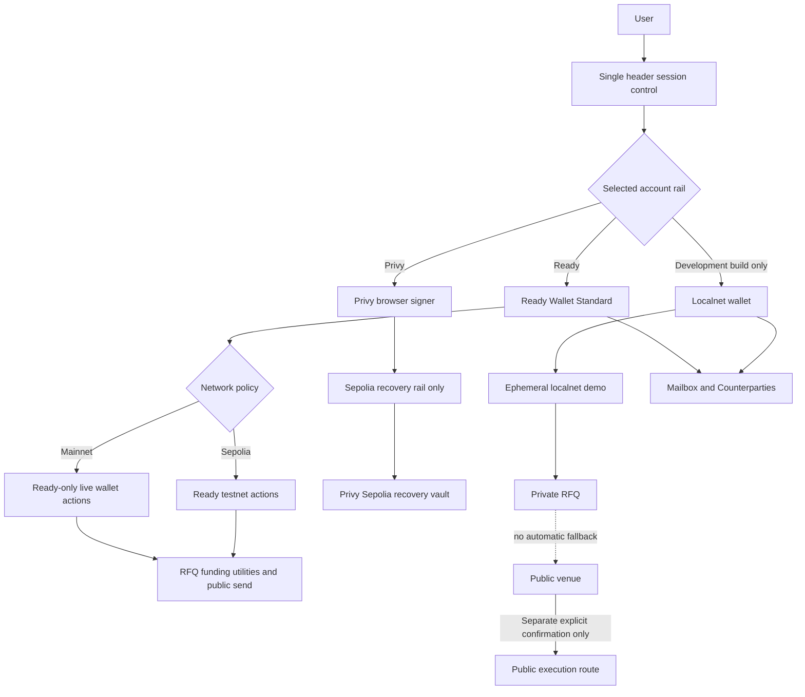
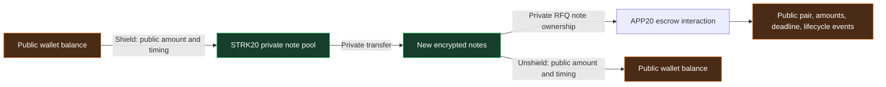
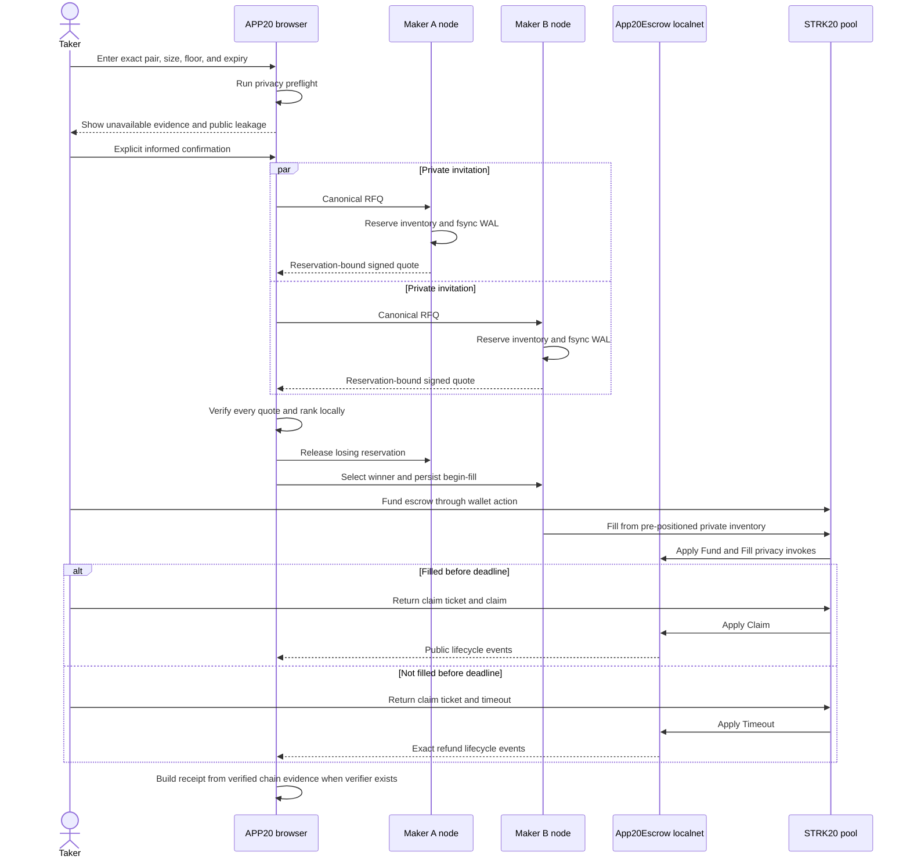
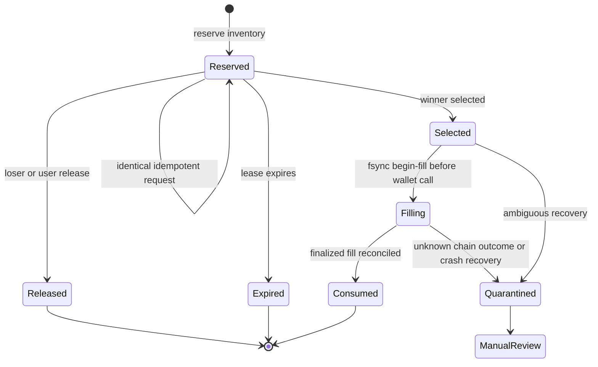
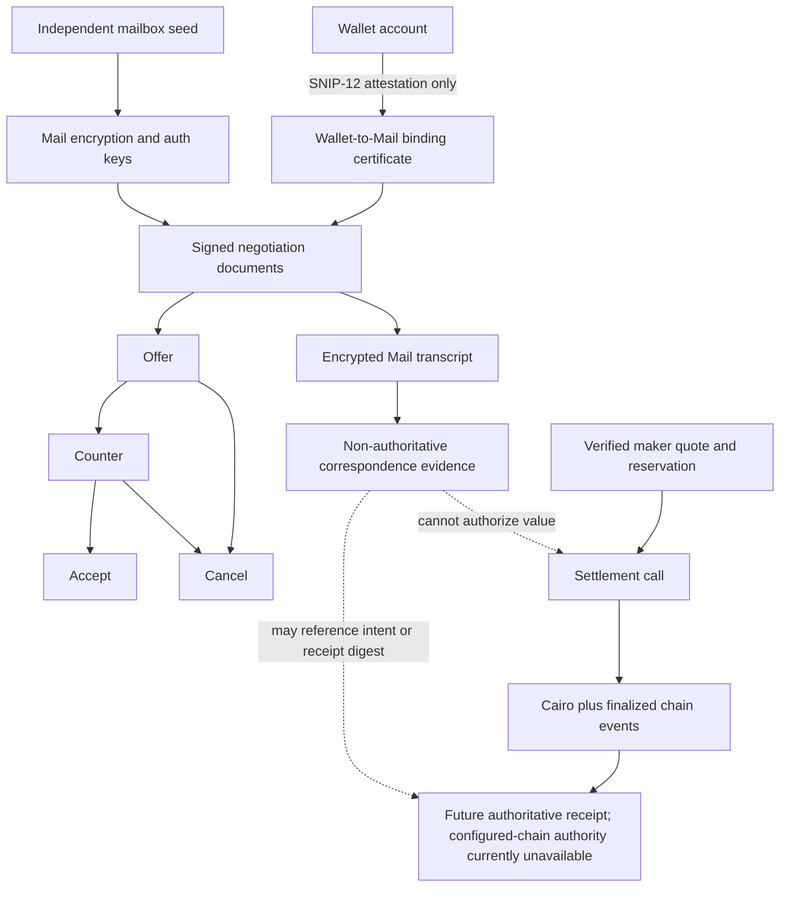
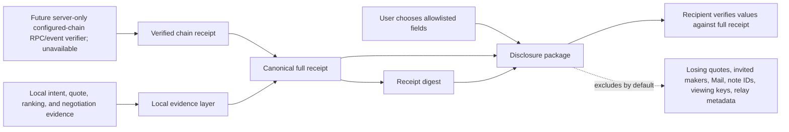
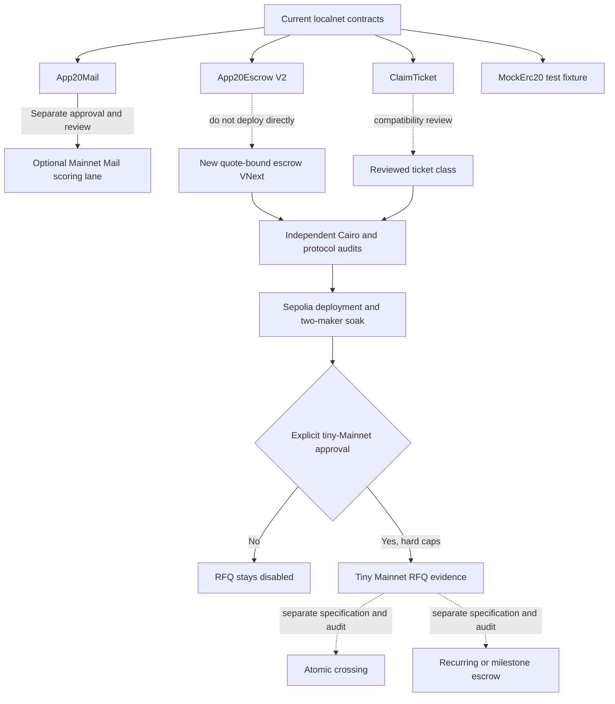
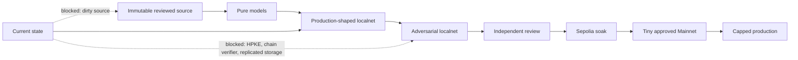

# APP20 process diagrams

These Mermaid diagrams describe current repository behavior and explicit future gates. Dashed or blocked paths are not live capabilities.

## 1. Wallet, network, and product rails

Mainnet rejects Privy and the development wallet. Localnet exists only when its build flag is enabled. Selecting one rail never silently borrows another rail's signer.

## 2. STRK20 funding and privacy boundary

Inside the pool, note ownership and private-transfer counterparties can be hidden. Shield/unshield and first-version escrow facts remain public and correlatable.

## 3. Invited-maker RFQ and settlement

Only invited makers receive exact pre-trade terms. There is no public RFQ book and refusal never triggers automatic public routing.

## 4. Maker reservation and crash recovery

Every mutation is hash-chained and fsynced before success returns. Localnet uses one PID lock per maker WAL; production still needs replicated linearizable storage and reconciliation.

## 5. Mail, negotiation, and settlement authority

Wallet signatures attest correspondence-key control; they are never encryption-key material. Mail and negotiation can preserve evidence but cannot invoke or prove settlement.

## 6. Receipt and selective disclosure

A receipt or disclosure digest binds bytes but is not authorization. A disclosure is a selected package, not a zero-knowledge or Merkle proof, and copied disclosures cannot be revoked.

## 7. Contract rollout and release gates

`App20Escrow` is a localnet development contract, not the production class. Every later contract has a separate specification, audit, deployment, and human-approval gate.

## 8. Release evidence ladder

Passing a later-looking UI test cannot skip an earlier trust gate. Current release evidence allows localnet demonstration and dry review only.
