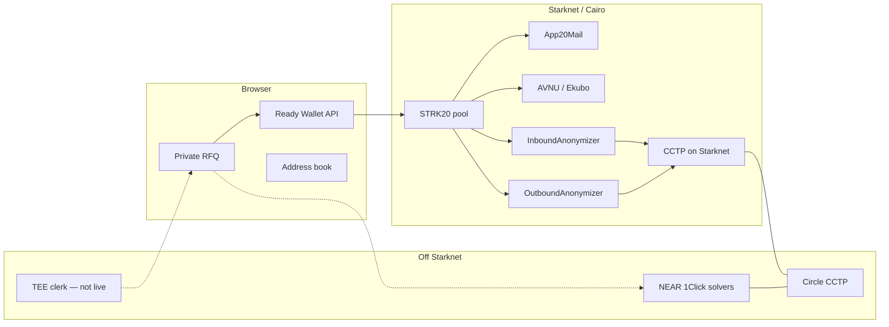
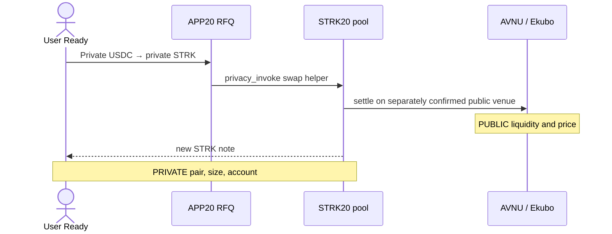
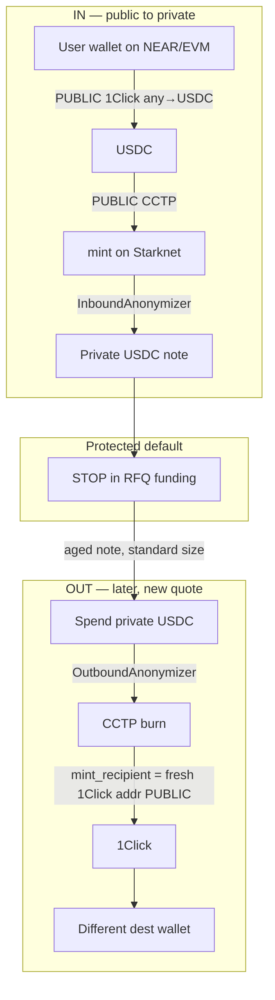
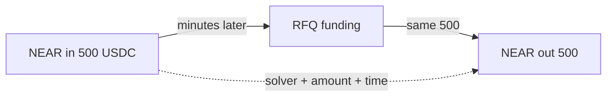
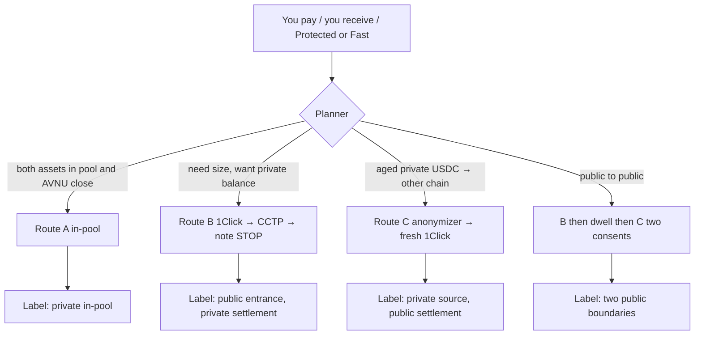
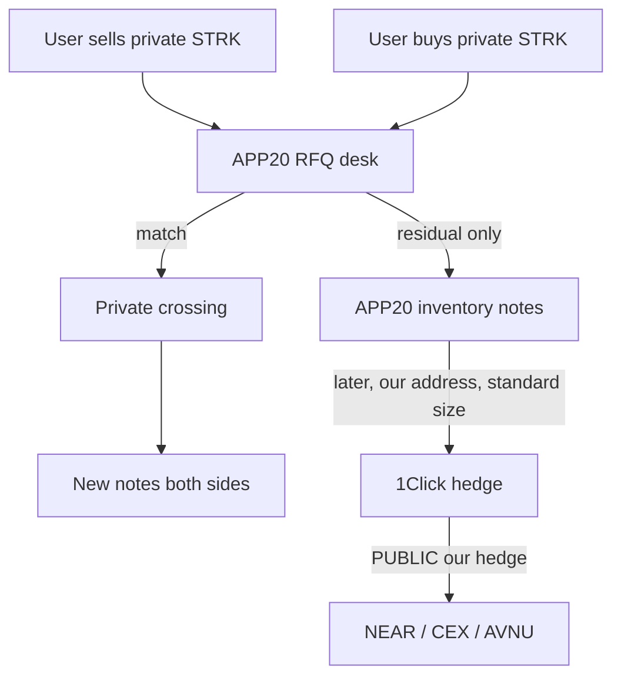
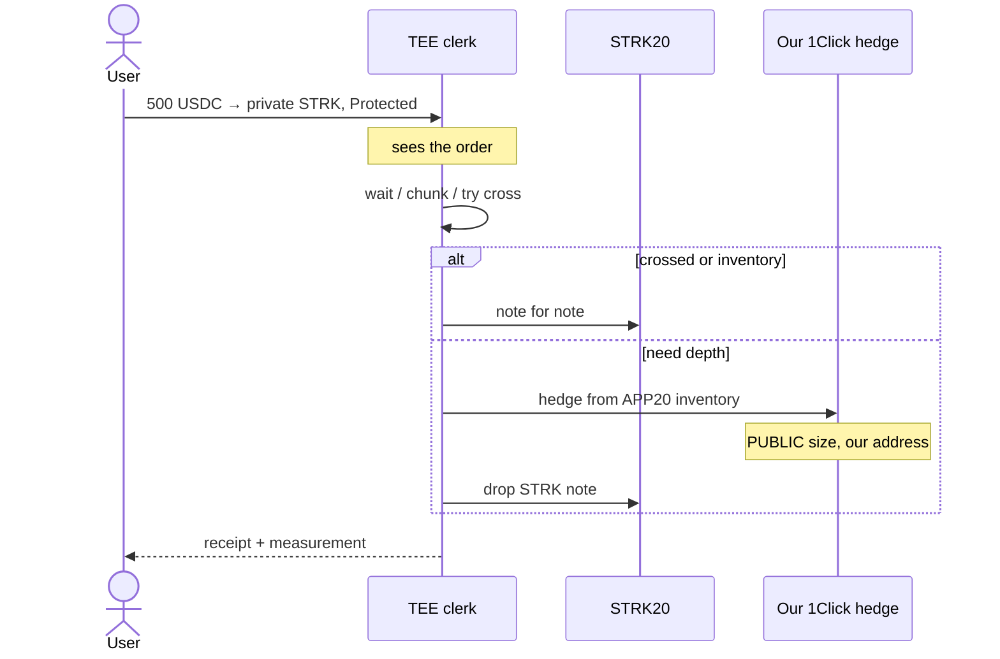
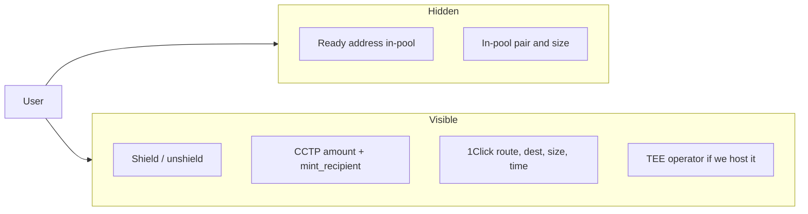
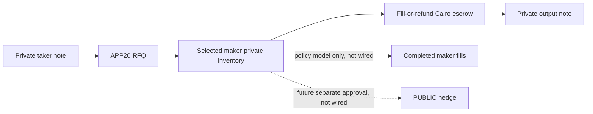
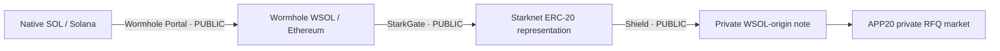

# APP20 value flows

**Operative scope:** section 8 describes the current build-gated localnet RFQ.
Sections 0–7 are archived pre-RFQ architecture sketches, not current product
capabilities or approved backlog: APP20 does not wire an AVNU/Ekubo swap helper,
anonymizer/CCTP ingress, public execution, a route composer, private crossing,
or a TEE clerk. Section 9 is a separately gated future market proposal outside
the definitive RFQ goal. No diagram in this document grants settlement or
deployment authority. See [`GAPS.md`](GAPS.md).

Boxes marked **PUBLIC** identify information that a hypothetical flow would
expose. **PRIVATE** means only that an in-pool STRK20 transfer can hide selected
note ownership; it is not an anonymity or unlinkability claim.

## 0. Archived dependency sketch — not a current APP20 flow



---

## 1. Rejected in-pool public-venue sketch — not implemented

APP20 has no wired AVNU/Ekubo swap helper and makes no liquidity or privacy-performance claim for this sketch. A refused RFQ never routes here automatically.



---

## 2. Archived USDC/CCTP ingress sketch — not implemented

This was a hypothetical **USDC + CCTP** boundary. NEAR remains a dry review rail; APP20 exposes no deposit address or live cross-chain execution.



The sketch intended to avoid directly reusing the Ready address as the funder address. It would not establish unlinkability across size, time, Circle, or 1Click.

---

## 3. What does *not* break the link



Same number, short wait, maybe same solver = one payment. Addresses changed; the link did not.

---

## 4. Rejected Private Swap composer — not implemented

This automatic router conflicts with the current explicit-rail product and is not approved.



---

## 5. Rejected book/crossing sketch — outside the definitive RFQ goal

APP20 is bookless. It does not cross takers or operate a public book; atomic crossing would require a separate product decision, specification, and audit.



Under this rejected sketch, the taker would not contact 1Click directly; APP20 would see the RFQ and the public market would see an APP20 hedge.

---

## 6. Rejected TEE clerk sketch — not implemented

No TEE can sign or submit APP20 value. Attestation would not make this a stronger mixer.



Under this rejected sketch, the pool transaction would omit a direct Ready address while the enclave would see the order and public markets would see the hedge.

---

## 7. Who can see what



In the current localnet RFQ only, Cairo and finalized pool state govern the
fixture settlement boundary. The NEAR, CCTP, and TEE roles above are archival
sketches, not active APP20 services. None would turn a same-size round trip into
unlinkability.

---

## 8. Focus market — private USDC ↔ STRK RFQ

The first market is intentionally narrow. APP20 quotes from pre-positioned
private inventory, locks the taker note in Cairo escrow, and either fills before
the deadline or returns the original asset after expiry.



The localnet browser coverage exercises both STRK→USDC and USDC→STRK with a
six-decimal USDC fixture, a deterministic test price, local maker-note inventory,
and fail-closed insufficient-inventory handling. It is not a production price
feed, deployed market, or yield product.

The current localnet flow is a maker-principal RFQ fixture. Operational netting of completed fills exists as a fail-closed policy model, not a wired execution route. Atomic two-taker crossing is outside the definitive RFQ goal and would require a separate future specification and audit. Bridges and public hedges are possible future operator infrastructure, not current APP20 capabilities.

---

## 9. Separately gated future SOL-market proposal — not approved

This proposal is outside the definitive RFQ goal and no token admission, bridge
enrollment, deployment, or live test is authorized. A SOL-denominated Starknet
market might be technically possible through the existing
Wormhole representation on Ethereum and StarkGate. It must never be labeled
native SOL on Starknet.



Candidate Ethereum asset:

```text
Wormhole SOL ERC-20
0xd31a59c85ae9d8edefec411d448f90841571b89c
```

Before APP20 admits it, an operator must:

1. Verify the exact Wormhole origin, implementation, decimals, redemption path,
   and current contract status from first-party sources.
2. Query `StarkgateRegistry.getBridge(token)`. Do not assume the token is
   enrolled or shown in the StarkGate UI.
3. If enrollment is permitted and approved, use the StarkGate Manager's
   `enrollTokenBridge(token)` flow and independently verify the resulting L2
   token returned by the canonical bridge.
4. Complete a tiny round trip: Solana → Ethereum representation → Starknet →
   Ethereum → Solana. A one-way deposit is not sufficient evidence.
5. Verify Ready and STRK20 can discover, shield, transfer, and unshield that
   exact L2 token.
6. Seed bounded solver notes and demonstrate both fill and expiry refund before
   exposing the pair.
7. Measure exit liquidity and disable quoting if the bridge, oracle, redemption,
   or inventory health check fails.

This asset stacks Wormhole, Ethereum, StarkGate, Starknet, and STRK20 risk. A
same-symbol token from any other contract is a different asset and must be
rejected.

### Maker earnings are a later, separate product

People cannot earn from the current escrow. A maker programme would require a
reviewed inventory-vault/accounting design that defines:

- which exact token notes the maker supplies;
- whether capital remains non-custodial or enters a managed vault;
- how filled principal, spreads, losses, and bridge costs are attributed;
- withdrawal queues and inventory concentration limits;
- bridge/depeg/adverse-selection loss disclosure;
- jurisdiction, sanctions, tax, and licensing treatment.

Returns would come from realized RFQ spreads and fees, not guaranteed yield.
APP20 must not advertise earnings until that accounting is implemented, audited,
and producing attributable realized results.

First-party references:

- [Wormhole Token Bridge](https://wormhole.com/docs/products/token-transfers/wrapped-token-transfers/portal/)
- [StarkGate app](https://starkgate.starknet.io/)
- [StarkGate contracts](https://github.com/starknet-io/starkgate-contracts)
- [StarkGate reference](https://docs.starknet.io/learn/cheatsheets/starkgate-reference)
