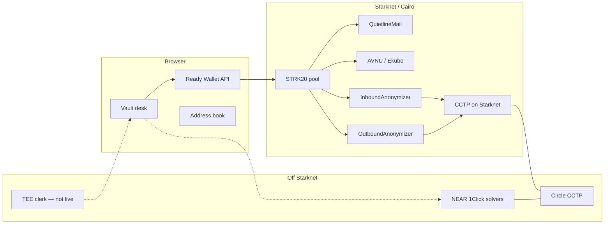
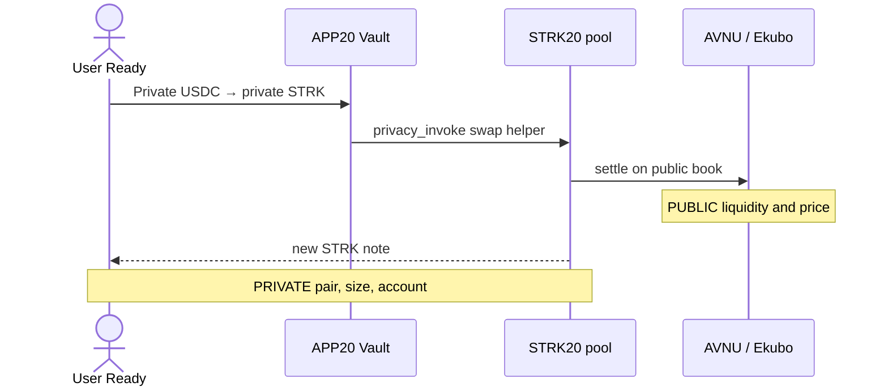
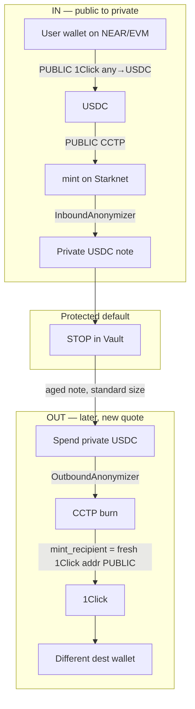
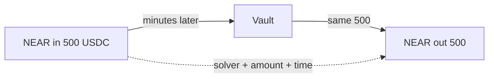
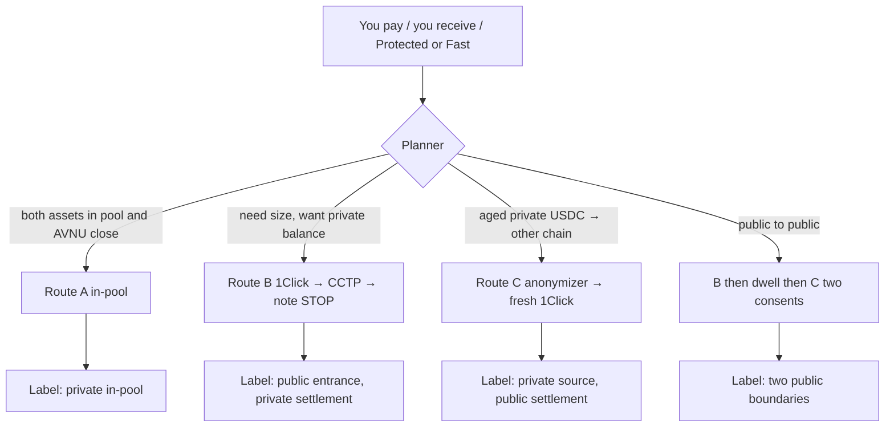
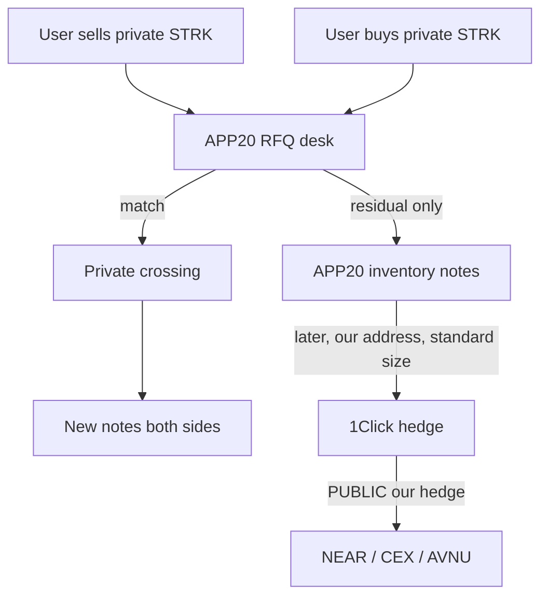
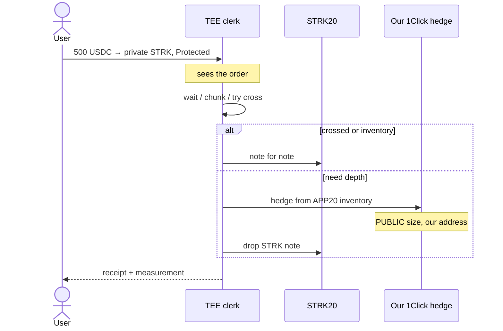
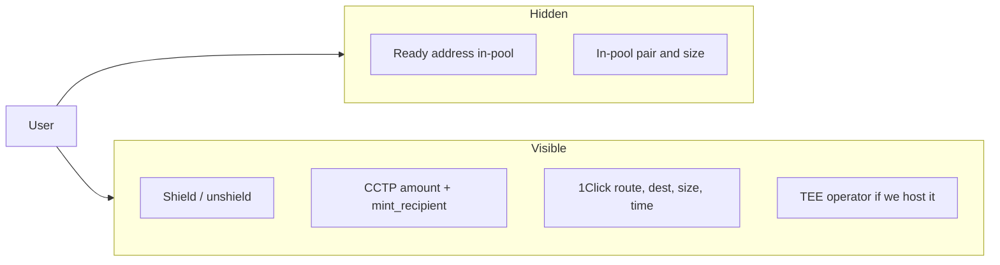

# APP20 value flows

What the current stack can do, and what we can invent on top.
Boxes marked **PUBLIC** leak account, amount, or timing.
Boxes marked **PRIVATE** are in-pool STRK20 (Ready is not on that hop).

## 0. Tech we actually have

---

## 1. Stay private — in-pool swap

Best hide. Depth = Starknet only (AVNU is often thin).

---

## 2. Hide the wallet, buy depth — USDC door

Privacy-bridge is **USDC + CCTP only**. NEAR is the public book.

Breaks: Ready address ↔ funder address.  
Does not break: size, time, Circle, 1Click.

---

## 3. What does *not* break the link

Same number, short wait, maybe same solver = one payment. Addresses changed; the link did not.

---

## 4. Invented: one Private Swap composer

User never picks Bridge vs Intents vs AVNU.

---

## 5. Invented: APP20 as the book

We add STRK depth by **inventory + crossing**, not by copying NEAR into Cairo.

User never hits 1Click. We see the RFQ. Public market sees **our** hedge.

---

## 6. Invented: TEE clerk

Automation and policy. Not a stronger mixer.

Disclose: chain does not see Ready. Enclave sees the order. Markets see the hedge.

---

## 7. Who can see what

Cairo enforces the vault door on Starknet.  
NEAR is depth.  
CCTP is the USDC pipe.  
TEE is the clerk.  
None of them turn a same-size round trip into unlinkability.
